# Writting & Presentation Week 1


## Unix Comand Line

### - Command Line Interface (CLI)
Adalah mekanisme interaksi dengan sistem operasi atau perangkat lunak komputer dengan mengetikkan perintah untuk menjalankan tugas tertentu.contoh CLI yaitu diantaranya sh, bash, zsh, cmd.exe

### - Shell
Shell adalah program yang menerima perintah, kemudian meneruskan perintah tersebut ke system untuk dieksekusi. Selain command line, kita juga punya shell berbasis grafis yang lebih dikenal dengan nama GUI atau graphical user interface.
    
### - Terminal
User dan komputer dihubungkan dengan namanya terminal, yaitu tempat/aplikasi dimana user dapat mengetikan atau memberikan suatu perintah. Disinilah tempat dimana shell akan berperan.
    
### - File System
Sebuah filesystem mengatur bagaimana data disimpan di dalam sebuah system Sistem operasi Windows & Unix-like menyusun file dan direktori menggunakan struktur yang bentuknya mirip tree contohnya seperti di bawah
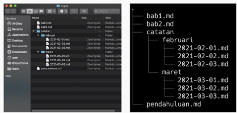

## Command untuk Navigasi
- pwd (Print working directory) adalah Command untuk melihat current working directory
- Lis (lists) adalah Command untuk melihat isi file yang ada di sebuah direktori
- cd directory (change directory) adalah Command untuk berpindah direktori.

#### Manipulasi File dan Direkori
#### Command untuk Membuat files & direktori
- touch adalah Command untuk membuat sebuah file
- mkdir adalah Command untuk membuat sebuah direktori

#### Command untuk Melihat isi files
- head adalah Command untuk melihat beberapa line awal dari sebuah file text
- tail adalah Command untuk melihat beberapa line awal dari sebuah file text
- cat adalah Command untuk melihat isi sebuah file

#### Command untuk Menyalin, memindahkan, dan menghapus files & directory
- cp adalah Command untuk mengcopy files atau directory
- mv (move) adalah Command untuk memindahkan files atau directory. Bisa digunakan untuk rename.
- rm (remove) adalah Command untuk menghapus file atau directory


#  Git & Github

### Apa Itu Git & Github

- Git
  adalah salah satu sistem pengontrol versi (Version Control System) pada proyek perangkat lunak yang bertugas mencatat setiap perubahan pada file proyek yang dikerjakan oleh banyak orang maupun sendiri.
  
- Github
  merupakan layanan cloud yang berguna untuk menyimpan dan mengelola sebuah project yang dinamakan repository (repo git).

### **Mengapa Git & Github Penting?**

Dengan menggunakan GIT dan Github, 
kita akan bisa bekerja dalam sebuah tim. Tujuan besarnya adalah bisa berkolaborasi mengerjakan proyek yang sama
tanpa harus repot copy paste folder aplikasi yang terupdate.

### **Alur Kerja Git & Github**
1. Untuk langkah pertama dalam menggunakan git dan github, kita perlu mendownload terlebih dahulu GitBash. 
2. jika sudah, installasi seperti pada umumnya, 
3. kemudian melakukan setup awal dengan memasukan email dan username seperti di bawah ( Email yang disetup **Harus sama** dengan yang di gunakan di GITHUB)
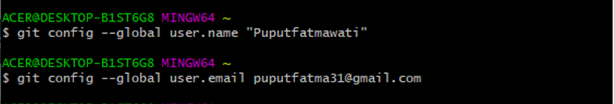
4. selanjutnya cek apakah setup berhasil atau tidak
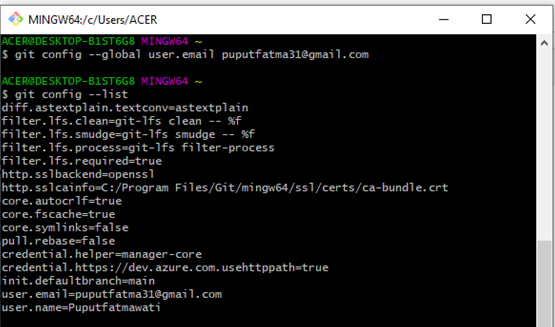

- **Repositori Git**<br/>
Repository adalah direktori proyek yang kita buat. 1 Repo =  1 Proyek = 1 Direktori. <br/>

  - Perintah dasar git yang lain
    1. git init <br/>
    Perintah git digunakan untuk membuat repository di file lokal <br/>

            git init

    2. git add <br/>
    Perintah git add bisa digunakan untuk menambahkan file ke index. Seperti contoh, perintah berikut akan menambahkan file bernama README.md yang ada di direktori lokal ke index: <br/>

            git add README.md

    3. git commit <br/>
    Perintah git commit digunakan untuk melakukan commit pada perubahan ke head. Ingat bahwa perubahan apapun yang di-commit tidak akan langsung ke remote repository.
    
            git commit –m “Isi dengan keterangan untuk commit”

    4. git branch <br/>
    Perintah git branch bisa digunakan untuk me-list, membuat atau menghapus branch. 

            git branch -M main
        Untuk menghapus branch:
        
            git branch -d <branch-name>
            
    5. git remote</br>
    Perintah git remote digunakan untuk membuat remote dalam git 

            git remote add origin git@github.com:Puputfatmawati/html.git
    
    6. git push</br>
    digunakan dalam mengirimkan perubahan file yang dilakukan setelah di commit ke remote repository

            git push -u origin main

    6. git log <br/>
    Dengan menjalankan peritah ini akan menampilkan daftar commits yang ada di branch beserta detail-nya.</br>
            
            git log
            
    7. git checkout <br/>
    Perintah git checkout bisa digunakan untuk membuat branch atau untuk berpindah diantaranya. Misalnya, perintah berikut ini akan membuat branch baru dan berpindah ke dalamnya:
    
            command git checkout -b <nama-branch>
        Untuk berpindah dari branch satu ke lainnya, gunakan:
          
            git checkout <branch-name>
    8. git reset <br/>
    Untuk me-reset index dan bekerja dengan kondisi commit paling baru, gunakan perintah git reset:

            git reset --hard HEAD
    
    9. git clone </br>
    Langkah pertama untuk membuat clone kita harus mengakses link repository yang ingin di clone, contoh nya seperti pada gambar di bawah
    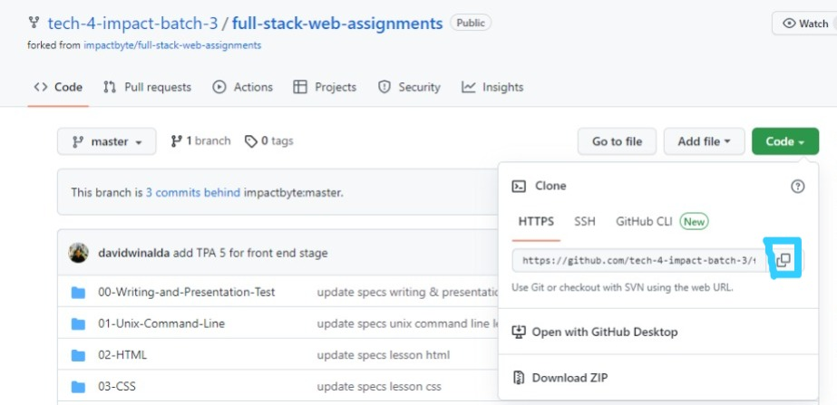
    setelah itu buka git bash/cmd dan masuk ke dalam direktori penyimpanan untuk menyimpan hasil clone. kemudian ketik

            git clone "link repositori yang ingin simpan"

          jika sudah selesai maka tampilannya akan seperti ini
      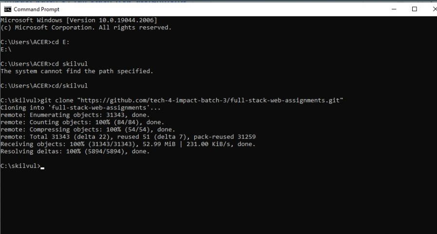
# HTML ( Hypertext Markup Language)

- **Definisi HTML**

  Adalah bahasa komputer yang digunakan untuk membuat kerangka atau struktur dalam membuat halaman website, yang diakses melalui internet. Contoh konten yang dapat ditampilkan seperti Text, Image, Video, Link, dan masih banyak lainnya. 

- Tools yang di gunakan HTML
  Ada 2 tools utama yang harus dipersiapkan untuk membuat HTML
  1. Browser seperti Chrome, Firefox, Edge, Safari, opera dll
  2. Code Editor seperti Visual studio code, sublime


### Dasar-dasar HTML
Kita bisa menuliskan HTML tanpa structure dan kita bisa tetap menjalankan nya tetapi untuk menjalankannya dengan baik kita perlu HTML Structure

### **Struktur Dokumen HTML**

#### Kerangka HTML
Dokumen HTML memiliki 3 tag utama, yaitu html,head, dan body. Ketiga tag tersebut harus diketik persis seperti contoh di bawah ini:

 ```html
     
<!DOCTYPE html>
<html>
  <head>
  ...
  </head>
  <body>
    ...
  </body>
</html>
  
```
Penjelasan dari contoh di atas:</br>
    1. ```<!DOCTYPE>``` syntax mendefinisikan versi dari HTML yang digunakan dan harus dideklarasi sebelum tag ``<html>. <!DOCTYPE html>``mendefinisikan bahwa dokumen ini adalah HTML5.</br>
    2. ```<html></html>``` adalah root element dari halaman HTML. Semua HTML tag lainnya harus dibungkus dengan tag ini.</br>
    3. ```<head>``` pada umumnya berisi ```<meta>```, ```<title>```, konten css/js internal maupun link ke file css/js eksternal.</br>
    4. ```<body>``` berisi konten website yang ingin ditampilkan pada browser.

- **HTML** tersusun sebagai kesatuan dari sebuah tingkatan (family tree relationship).

- **Child element** adalah saat sebuah element berada di dalam element lain.

- **Parent element** adalah element yang berada diatas element lain.

### HTML Element

**HTML element** merupakan sebuah komponen dalam halaman web, bisa berupa paragraf, judul, atau gambar.didefinisikan dengan opening tag, content, dan closing tag.
HTML Element terdiri dari:
  - Opening Tag (tag pembuka) - contohnya adalah ```<p>```.
  - Closing Tag (tag penutup) - contohnya adalah ```</p>```.

### HTML Attributes

**Attribute** adalah properties dari sebuah HTML Element.
Semua HTML Element memiliki attribute, contoh:</br>

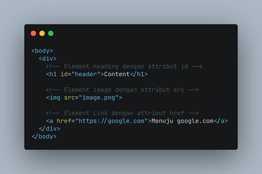
pada contoh gambar di atas memiliki 3 atribut yaitu:
- ``id`` berfungsi sebagai id / identitas unik dari setiap elemen., 
- ``src`` yang berfungsi untuk menentukan sumber gambar, dan diberikan value (nilai) untuk diarahkan ke tautan, dan 
- ``href`` berfungsi untuk membuat suatu hyperlink antar halaman HTML

### HTML Content (Konten)

**Content(Konten)** ini adalah sebuah konten yang ingin di tampilkan di browser contohnya seperti 
```html
<body>
    Ini Adalah Website pertamaku
</body>
```
### HTML Comment
Comment adalah catatan kecil yang bisa kita tambahkan ke dalam kode sumber (source code) tanpa mengubah fungsi dari program yang kita buat. <br/> HTML comment diawali dengan ```<!--``` dan diakhiri dengan ```-->```.
 contoh comment
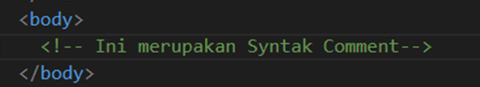

Comment ini pasti selalu ada dalam bahasa pemrograman apapun.
Comment tidak akan dieksekusi oleh sistem.
Comment hanya untuk dibaca oleh sesama programmer.

### Heading<br/>
  Tag heading hanya memiliki 6 tingkatan. Penulisannya seperti di bawah ini:
      
      <h1>Heading Satu</h1>
      <h2>Heading Dua</h2>
      <h3>Heading Tiga</h3>
      <h4>Heading Empat</h4>
      <h5>Heading Lima</h5>
      <h6>Heading Enam</h6>
  Hasilnya akan seperti pada gambar berikut:

  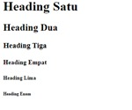
### Cara Menjalankan HTML

Kita bisa menjalankan HTML dengan mencari lokasi file HTML kita lalu membukanya via browser. Tetapi dapat juga dengan menggunakan *Live Server* pada Visual Studio Code. </br>

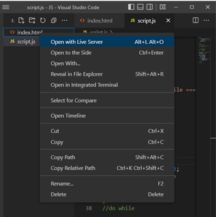 </br>
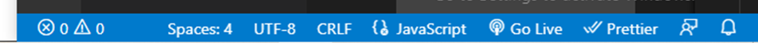

### Tag HTML
- Tag Untuk Menampilkan gambar
```html
     </img>
```
**Hasilnya**

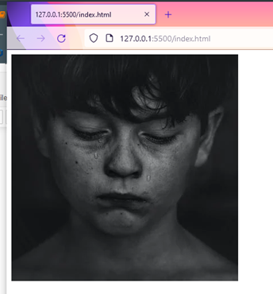

 Attribute ```alt``` memberikan informasi alternatif atas gambar jika pengguna tidak bisa melihat gambar di website yang di buat dan gambar tidak bisa muncul.

- Tag Untuk Membuat tulisan miring dan tebal
```html
<i>Hallo</i> <b>Hallo</b>
```
**Hasilnya**

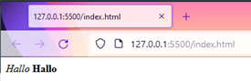

dari gambar di atas, tag ``<i></i>`` untuk membuat text miring sedangkan ``<b></b>`` adalah untuk membuat text menjadi tebal
- Tag Untuk membuat daftar atau List
     - Ordered List</br>
        untuk membuat ordered list kita bisa menggunakan tag `<ol></ol>`

   - Unordored List</br>
        sedangkan untuk membuat unordered list kita bisa menggunakan tag `<ul></ul>`


- Tag Link</br>
untuk membuat Link pada halaman web, maka diperlukan tag ```<a>```. Tag ```<a>``` memiliki attribute href yang berguna untuk menyimpan link website yang dituju.
  penggunaannya seperti:
```html
<a href="">Selamat datang di web development</a>
```
**Hasilnya**

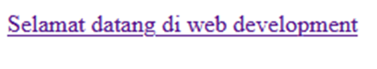

- Tag paragraph</br>
untuk membuat sebuah paragraph maka di perlukan sebuah tag `<p></p>` 

- Tag Vidio</br>
 untuk bisa menambahkan video pada halaman web kita; yaitu dengan menggunakan tag ```<video>```. Format video yang didukung antara lain: mp4, ogg, dan webM.<br/>
 contohnya 
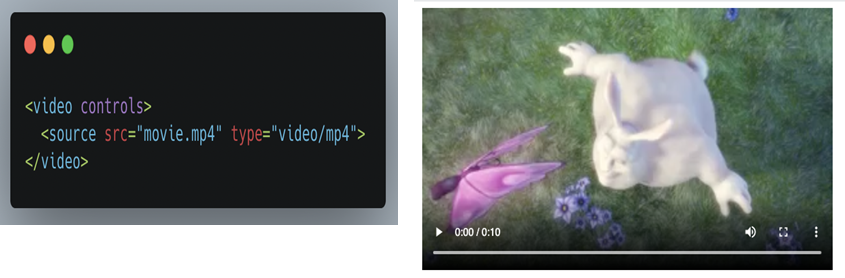

  - **Controls** </br>
  berguna untuk kita bisa mengatur videonya di play / pause dan indikator menit. kita bisa tambahkan atribut controls seperti ini
    ```html
        <video width="320" height="240" controls>
    ```
  - **Autoplay**<br/>
    Untuk memulai videonya secara otomatis. Kita bisa tambahkan attribute autoplay di dalam element  ```<video>``` nya seperti ini
    ```html
      <video width="320" height="240" autoplay>
    ```
- Tag Audio <br/>
   Untuk menampilkan suara pada halaman sebuah website bisa menggunakan tag ```<audio>```. Format yang didukung pun meliputi mp3, wav, dan ogg.<br/>
  Contoh penggunaan:
  ```html
      <audio controls>
        <source src="link-ke-file-audio" type="audio/tipe-audionya" />
      </audio>
  ```
- Tag table</br>
  table adalah salah satu elemen yang akan sering kita temukan dan gunakan. untuk membuat sebuah tabel di HTML cukup membutuhkan tiga tag, yaitu:
  - ```<table>``` 
  - ```<tr>``` 
  - ```<td>``` </br>
  Contoh:
  ```html
      <table>
        <thead>
          <tr>
            <th>Nama</th>
            <th>Nomor Telpon</th>
            <th>Kota</th>
          </tr>
        </thead>
        <tbody>
          <tr>
            <td>Innara</td>
            <td>6281764477</td>
            <td>Semarang</td>
          </tr>
          <tr>
            <td>Bagas</td>
            <td>6281611811</td>
            <td>Jakarta</td>
          </tr>
        </tbody>
        <tfoot>
          <tr>
            <th>Nama</th>
            <th>Nomor Telpon</th>
            <th>Kota</th>
          </tr>
        </tfoot>
      </table>
  ```
  Tampilannya akan seperti ini:

    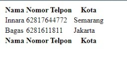

- Tag form </br>
 Salah satu contoh element form yaitu registrasi dan login. Tag ```<form>``` digunakan untuk mengawali pembuatan form.<br/>
  Contoh penggunaannya:
```html
      <form action="/path">
        <!-- Elemen pada formulir -->
      </form>
```

- Tag input </br>
Tag ```<input>``` digunakan untuk membuat kotak input dimana user akan mengisi data.<br/>

- Tag Select and Option <br/>
  untuk membuat selection dan option dapat Menggunakan tag ```<select>``` dan ```<option>``` dalam membuatnya.<br/>
    Contoh:
    ```html
        <select>
          <option value="Jakarta">Jakarta</option>
          <option value="Surabaya">Surabaya</option>
          <option value="Bandung">Bandung</option>
        </select>
    ```

- Tombol<br/>
    Untuk membuat sebuah tombol yang dapat diklik, maka kita memerlukan tag ```<button>```, dan juga bisa menggunakan tag ```<input>``` dengan type button atau submit.<br/>
    Contoh:
    ```html
        <button>Klik di sini</button>
    ```
    Hasilnya

    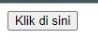

- Layout Website<br/>
  Layout suatu website biasanya terdiri dari:
  - Header
  - Navigation bar
  - Main Content
  - Footer
  Penentuan layout pada halaman website hanya menggunakan tag ```<div>``` dan ```<span>``` dan dibantu dengan attribute id atau class untuk memperjelas element header, section, main, dan lain-lain.</br>

- **Semantic HTML**, **Semantic** artinya kita menggunakan element html yang sesuai dengan kebutuhan konten. kegunaan lain dari semantic HTML, yaitu:
    - Meningkatkan Accessibility 
    - Meningkatkan SEO 
    - Lebih mudah di maintain </br>

  Beberapa contoh dari semantic element:</br>
    - ```<section>``` 
    - ```<header>``` 
    - ```<footer>``` 
    - ```<article>``` 
    - ```<nav>``` 
    - ```<aside>``` 

- **Deploy HTML, Deploy** adalah sebuah proses untuk menyebarkan aplikasi yang sudah kita kerjakan supaya bisa digunakan oleh orang-orang untuk mendeploy kita bisa menggunakan layanan yang bernama **Netlify**

# CSS (Cascading Style Sheets)

CSS adalah bahasa yang digunakan untuk mendesain halaman website. Dengan CSS, kita bisa mengubah warna, menggunakan font custom, editing text format, mengatur tata letak, dan lainnya.
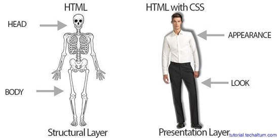

### Strukture CSS
```css
 h1 {
    color: black;
  }
```
**penjelasan**
- h1 adalah sebuah selektor berupa element html yang akan di ubah
- color Adalah sebuah properti berupa bagian mana dari element HTML yang akan diubah. Contoh diatas akan mengubah warna dari teks yang ada di element h1
- black adalah value nilai/hiasan berupa warna black</br>
pada struktur di atas stuktur css terdiri dari 3 bagian :
  - selector
  - blok deklarasi
  - properti dan nilainya

### CSS Comment
sama dengan comment pada html, comment pada css juga tidak akan di eksekusi oleh sistem dan untuk memberikan penjelasan dari line kode yang di kerjakan. comment akan selalu ada dalam bahasa pemrograman apapun.
### cara menggunakan css
1. inline style adalah menambahkan CSS pada attribute element HTML. kia bisa langsung menambahkan css pada atribut HTML 
      ```html
        <p style="color:blue">Tulisan Berwarna biru</p>
      ```
      Hasilnya</br>

      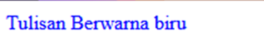 </br>
  2. internal Css
Kita menggunakan element/tag `<style>` untuk menyisipkan kode CSS. element/tag `<style>` diletakkan di dalam element `<head>`
      ```html
      <!DOCTYPE html>
      <html>
        <head>
          <title>Hallo</title>
          <style>
            body {
              background-color: aqua;
            }
            h1 {
              color: black;
            }
            p {
              color: brown;
            }
          </style>
        </head>
        <body>
          <h1>Selamat datang</h1>
          <p>di Website ku</p>
        </body>
      </html>
      ```
      **Hasilnya tampilanya**</br>

      

3. Eksternal CSS
Kita akan menyisipkan kode CSS dengan cara membuat file CSS terpisah, dan lalu menyambungkannya dengan file HTML dengan menggunakan element . Element tersebut diletakkan di dalam element
Contoh:

    Kita memiliki dua file: index.html untuk file HTML-nya dan styles.css untuk file CSS-nya.
    ```html
    <!-- File index.html -->

    <!DOCTYPE html>
    <html>
      <head>
        <title>Hello</title>
        <link rel="stylesheet" href="styles.css" />
      </head>
      <body>
        <h1>Selamat Datang</h1>
        <p>Di Websiteku</p>
      </body>
    </html>
    ```

    ```css
    /* File styles.css */

    body {
        background-color:violet;
      }
      h1 {
        color: black;
      }
      p {
        color: green;
      }
    ```
    **Hasil Tampilanya** </br>
    


### Mendesain HTML di CSS
- **Css-Tagname** adalah Kita bisa menggunakan Tag Elemen HTML secara langsung pada CSS. Jika menggunakan Tag Element, maka ini bersifat global.Global artinya akan mempengaruhi seluruh Tag Elemen HTML yang ada pada file tersebut </br>

- **CSS-Multiple Class** adalah dapat menggunakan lebih dari 1 class yang berbeda untuk 1 element HTML
- **Css ID Name** adalah ID Name bersifat unik artinya hanya ada 1 nama ID pada 1 element HTML. Biasanya digunakan jika hanya ada 1 element pada 1 page. 

- **Pseudo-class & Pseudo-element**<br/>
  pseudo-class digunakan untuk mendefinisikan keadaan khusus pada suatu element. Contoh:
  - Memberikan style pada link pada saat di-hover
  - Memberikan style pada link setelah di-klik (dikunjungi)
  - Memberikan style pada checkbox setelah dicentang

  
### **Chaining selector**
Chaining selector dapat digunakan pada case/kasus Jika kita memiliki 3 tag elemen HTML pada CSS namun kita ingin ada 1 elemen HTML yang memiliki styling berbeda.
### **Nested Element**
Konsep CSS sama dengan HTML yaitu setiap element memiliki parent dan child.
### **!important CSS**
important CSS berada di level paling atas dari ID dan Class. Maksudnya adalah jika pada styling CSS kita menggunakan !important, maka styling sebelumnya baik itu ID Name atau Class Name akan di override.


# Algoritma
- **Algoritma**
Adalah deskripsi berupa step-step yang dibutuhkan untuk menyelesaikan suatu masalah. Untuk menyelesaikan suatu masalah, tentunya kita harus mempunyai data struktur, nah data inilah yang akan kita gunakan untuk menyelesaikan suatu masalah dengan menggunakan algoritma.

- **Manfaat algoritma antara lain:**
    1. Membantu menyederhanakan suatu program yang rumit dan juga besar.
    2. Mempermudah pembuatan program yang dapat menyelesaikan masalah tertentu.
    3.  Membantu menyelesaikan suatu masalah dengan logika dan juga sistematis.

- **Ciri-ciri ALgoritma**
  1. Input Memiliki 0 atau lebih inputan
  2. Output Memiliki min 1 buah output
  3. Definiteness (pasti) Instruksi jelas tidak ambigu
  4. Finiteness (ada batas) Memiliki titik berhenti (stop)
  5. Effectiveness (tepat dan efisien) Sebisa mungkin tepat sasaran dan efisien

- **Jenis Proses ALgoritma**
  1. Sequence Instruksi yg dijalankan secara berurutan
  2. Selection Instruksi yg dijalankan jika memenuhi suatu kondisi
  3. Iteration Instruksi yg berulang kali dijalankan selama memenuhi suatu kondisi
  4. Concurrent Instruksi yg dijalankan secara bersamaan

- **Penyajian Algoritma**
    - Deskriptif Penulisan algoritma dengan cara deskriptif seperti kita menulis tutorial (tata cara) dengan bahasa sehari-hari
        
    - Flowchart atau diagram alir, penyajian algoritmanya lebih mudah dibaca karena memiliki tampilan visual. Flow chart menggunakan simbol bangun datar sebagai representasi dari proses yg dilakukan.

    - Pseudo Code Penulisan algoritma yg hampir menyerupai penulisan pada kode pemrograman disebut dengan pseudo code.</br>
        Pada umumnya pseudocode memiliki 3 bagian:
        1. Judul : Penjelasan dari algoritma yg dibuat
        2. Deklarasi : Mendefinisikan/menyiapkan semua nama (variabel) yg akan digunakan
        3. Deskripsi : langkah-langkah penyelesaian masalah

        Tidak ada aturan baku dalam penulisan pseudocode, asalkan:
        - Jelas
        - Simple
        - Konsisten
        - Dan mudah dibaca org lain

**Pseudocode berdasarkan kondisi masalah**

  1. **Procedural**
    
        Procedural adalah cara berpikir secara runtun. Artinya serangkaian perintah yang berurutan.

  2. **Conditional**
    
        Conditional digunakan saat dibutuhkan percabangan kasus. Komputer akan melakukan suatu tindakan jika suatu kondisi terpenuhi. Jika hari ini tidak hujan, maka Bob pergi ke pasar, jika tidak maka Bob dirumah aja.
        
  3. **Looping**

        Komputer dapat melakukan sebuah proses yang sama berulang-ulang. Jika membutuhkan perulangan dalam kasus tertentu, kita bisa  menggunakan Looping.
        
 **Recursive**

  Recursive adalah pola pikir dalam algoritma yang memanggil method/function didalam sebuah function


# JavaScript
- **Javascript**</br> 
adalah JavaScript adalah bahasa pemrograman yang digunakan dalam pengembangan website agar lebih dinamis dan interaktif.

- **Menjalankan JavaScript**</br>
  Javascript dijalankan melalui browser pada device setiap user. Umumnya browser Chrome dan Mozilla yang sudah support untuk semua fitur Javascript.

- **Syntax dan Statement**</br>
  Syntax bisa dianalogikan seperti kosa kata (vocabulary) dan tata cara (grammar) pada bahasa pemograman.
  Kita menggunakan syntax tertentu untuk membuat statement program, instruksi untuk djalankan/dieksekusi oleh web browser, compiler, ataupun intrepreter

Contoh Syntax JavaScript
- Alert()
- Prompt()
- Confirm()

## Console Log

**Console Log** adalah hal yang krusial bagi developer web.
**Console log** adalah tempat kita untuk cek logic pemograman web yang kita kembangkan.
Console log juga tempat kita untuk melakukan debugging (mengetahui error pada code) pada pemograman web

## Comment

**Comments** adalah sintaks yang digunakan untuk memberi keterangan tentang suatu statement. Menggunakan bahasa inggris atau bahasa indonesia.
**Comments** tidak akan dijalankan oleh program karena hanya untuk dibaca oleh sesama programmer ataupun diri sendiri untuk memahami maksud dan tujuan sebuah statement/syntax.
Terdapat 2 macam comment :
- Single Comment
- Multiline Comment

## Tipe Data (Data Types)

**Tipe data** adalah klasifikasi yang kita berikan untuk berbagai macam data yang digunakan dalam programming.

Ada 6 tipe data fundamental pada Javascript:
1. number </br>
2. string </br>
3. boolean </br>
4. null </br>
5. undefined :</br>
6. object</br>

## Variabel

Disemua bahasa pemograman, variable adalah container/tempat untuk menyimpan sebuah nilai.

**3 hal yang dapat dilakukan pada variabel**:
- Membuat variabel dengan nama yang jelas dan menggambarkan tentang data tersebut
- Menyimpan dan mengupdate informasi/data yang disimpan
- Mendapatkan/menampilan data yang tersimpan

**Ada 3 cara mendefinisikan sebuah variabel**:
- var
- let
- const </br>
Gunakan const jika variabel tidak dapat diubah nilainya.
Biasanya digunakan untuk menggambarkan konstanta sebuah nilai. Seperti konstanta pi = 3.14.

**Perbedaan antara var dan let**

- let dikenalkan pada versi javascript terbaru ES6
- Variabel let mendukung kaidah global variabel dan local variabel

Jadi, dianjurkan untuk menggunak let untuk variabel yang dinamis/dapat diubah.

**Aturan Penamaan Variabel**

- Harus mendeskripsikan tentang data yang disimpan
- Tidak bisa menggunakan number pada awal nama variabel
- Gunakan camelcase untuk penamaan yang lebih dari 1 kata. 

Contoh: myName, myAge

## Operator

1. Assignment Operator (=) : digunakan untuk menyimpan sebuah nilai pada variabel
2. Mathematical Assignment Operator
3. Increment dan Decrement : Gunakan increment atau decrement untuk menambah atau mengurangi sebesar 1 nilai.
4. Arithmetic Operator : Arithmetic operator adalah operator yang melibatkan operasi matematika.

    - Tambah (+)
    - Kuramg (-)
    - Perkalian (*)
    - Pembagian (/)
    - Modulus (%) : Modulus adalah hasil dari sisa bagi.

5. Comparison Operator

    - Comparison operator adalah operator yang membandingkan satu nilai dengan nilai lainnya.
    - Hasil operasi yang melibatkan comparison operator adalah antara true or false

    **Simbol comparison operator**:

    - Lebih kecil dari : <
    - Lebih besar dari: >
    - Lebih kecil atau sama dengan: <=
    - Lebih besar atau sama dengan: >=
    - Sama dengan: ===
    - Tidak sama dengan: !==

6. Logical Operator

    - Logical operator biasa digunakan untuk sebuah CONDITIONAL pada pemograman.
    - Menghasilkan nilai BOOLEAN yaitu TRUE or FALSE.

**Simbol dari Logical Operator adalah sebagai berikut:**

- AND operator : && (AND akan menghasilkan nilai true jika kedua atau semua premis bernilai TRUE.)
- OR operator: || (OR akan menghasilkan nilai true jika salah satu premis mengandung nilai TRUE)
- NOT operator: ! (NOT akan membalikkan sebuah nilai BOOLEAN. TRUE menjadi FALSE dan sebaliknya)

## JAVASCRIPT - CONDITIONAL
- **Conditional** </br>
Conditional merupakan statement percabangan yang menggambarkan suatu kondisi. Conditional statement akan mengecek kondisi spesifik dan menjalankan perintah berdasarkan kondisi tersebut Yang dicek adalah apakah kondisi tersebut TRUE (benar).
Jika TRUE maka code didalam kondisi tersebut dijalankan.</br>
  - contoh Conditional
    1. IF Statement
    ```js
    if (true) {
    console.log('ini adalah pesan')
    }
    ```
    ```js
    if (false){
      console.log('kode ini tidak akan dijalankan');
    }
    ```
    Hasilnya pada console </br>

    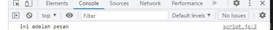

  2. IF … ELSE Statement
  else akan mengeksekusi sebuah statement/kode jika suatu kondisi bernilai **False**
  contohnya:
        ```js
        let lapar = false;
        if (lapar) {
          console.log('makan yu');
        }else{
          console.log('tidak makan');
        }
        ```
      Hasilnya pada console </br>

      
        
  3. IF .. ELSE IF Statement
  Else … If statement dapat kita gunakan jika kita mempunyai berbagai kondisi.
  contohnya:
        ```js
        let stopLight = 'green';
        if(stopLight === 'red'){
            console.log('Stop');
        }else if (stopLight === 'yellow'){
            console.log('slow down');
        }else if (stopLight === 'green'){
            console.log('Goo');
        }else{
            console.log('Caution,unknown');
        }
        ```
      Hasilnya pada console </br>
      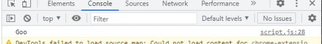

## Truthy and Falsy

Truthy and falsy digunakan untuk mengecek apakah variabel telah terisi namun tidak mementingkan nilainya.

### Truthy and Falsy Assignment

Analoginya adalah jika kita memiliki sebuah website dan meminta inputan username lalu menampilkannya. Jika usernamenya kosong kita bisa isi nilai tersebut.

## Switch Case Conditional

Penggunaan switch case jika kondisi dan percabangan terlalu banyak.

## Ternary Operator

Ternary operator merupakan short-syntax dari statement if … else.

# JAVASCRIPT - LOOPING

**Looping** adalah statement yang mengulang sebuah instruksi hingga kondisi terpenuhi atau jika kondisi stop/berhenti tercapai.

## A. Manual Looping

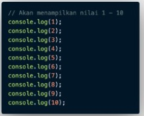

## B. For Loop

**FOR LOOP** merupakan instruksi pengulangan yang dapat kita berikan pada program yang kita kembangkan. `for loop` di gunakan jika kita tahu seberapa banyak nilai pasti untuk pengulangannya</br>

**FOR LOOP Parameter**

- Inisialisasi: Sebagai inisialisasi awal dari mana mulainya sebuah pengulangan. Kita memberikan nilai awal/default pada parameter ini
- Condition: For loop akan terus berjalan selama kondisi ini terpenuhi. Selama kondisi bernilai TRUE.
- Post-expression (Increment/Decrement): Iterasi statement yang digunakan untuk mengupdate variabel yang menjadi kontrol pada pengulangan
contoh
```js
let angka = 1;
for (angka; angka<= 10; angka++){
  console.log(angka);
}
```
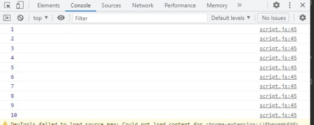

## C. While Loop

**WHILE LOOP** akan menjalankan instruksi pengulangan kondisi bernilai TRUE.Gunakan `while loop` jika kita tidak mengetahui jumlah pasti pengulangan.

## D. Do While

Terkadang kita ingin setidaknya menjalankan pengulangan 1 kali sebelum dilakukan pengecekan kondisi
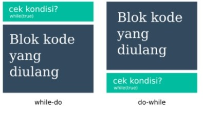

## E. Nested Loop

Jika kita membuat looping didalam looping. Maka ini dinamakan Nested Loop.
Looping pertama dianalogikan sebagai baris.
Looping kedua dianalogikan sebagai kolom
